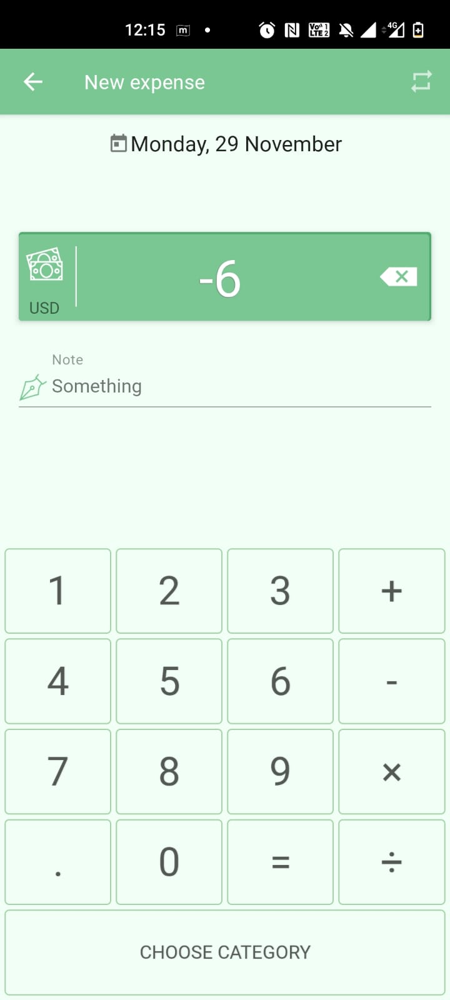
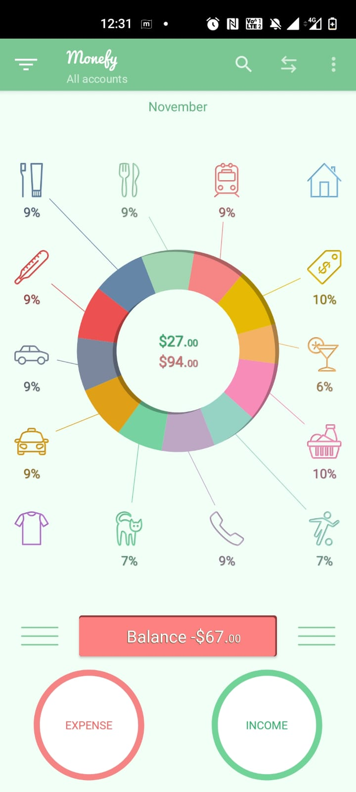
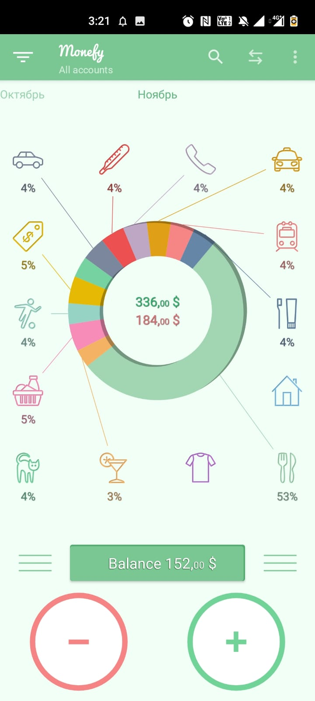
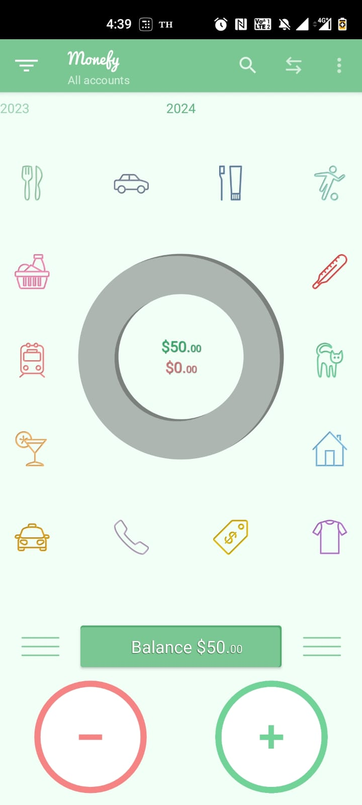
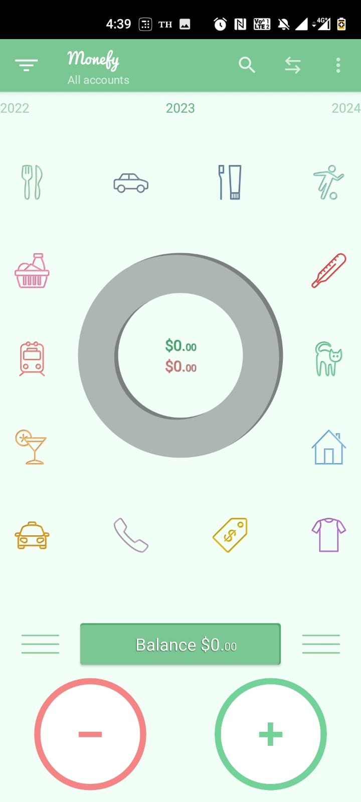
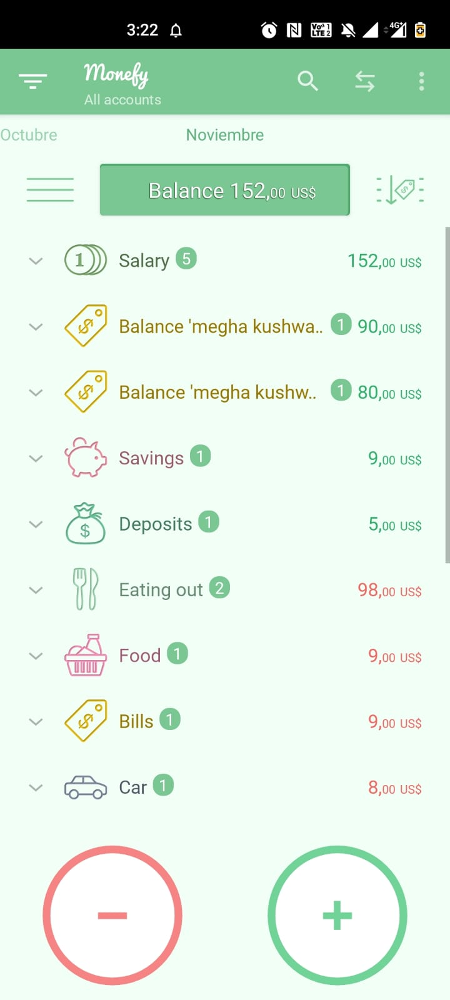

# Exploratory testing charters

Monefy is a money management app where you can add your expenses in a dedicated category and track your spending. Please find below some exploratory charters for this app:

---

<ins>**Explore**</ins> the expense button

<ins>**With**</ins> different categories that increases expense

<ins>**To discover**</ins> which category adds to the expense

#### <ins>Findings from the charter:</ins>
1. We need to enter amount first then only we can select the category.
2. We need to add notes before selecting the category otherwise the expense/income gets added without any notes and we need to specifically add the note later by opening that entry later.
3. We can change the date by clicking on the date appearing on "New expense" screen.

#### <ins>Bugs:</ins>
1. If we click on minus and then on any digit then the value is not turning to 0 as the case with other mathematical operations.

2. After killing app and again opening it the expense/income changes to -/+.

#### <ins>Observations:</ins>
1. Bills and Entertainment are very similar in colour, so it appears as if they are under same section in pie chart if the sections in-between are empty.
---

<ins>**Explore**</ins> the income button

<ins>**With**</ins> different categories that increases income

<ins>**To discover**</ins> which category adds to the income

#### <ins>Findings from the charter:</ins>
1. We don't have income categories in the pie chart.
2. A toast appears at the bottom everytime we add an income/expense which can be canceled.

---

<ins>**Explore**</ins> the balance button

<ins>**With**</ins> different entries for a month 

<ins>**To discover**</ins> the total that is displayed is correct

#### <ins>Findings from the charter:</ins>
1. Total is correct.
2. We can sort the expense/income on the basis of date and largest amount among the category.

#### <ins>Observation:</ins>
1. We cannot sort on the basis of the largest amount(expense/income) alone.

---

<ins>**Explore**</ins> different months/years

<ins>**With**</ins> adding expense/income under respective categories

<ins>**To discover**</ins> how we are maintaining data for different months and years

#### <ins>Findings from the charter:</ins>
1. Year gets added at the end for past/future dates.
2. Months between future/past dates gets added.

#### <ins>Bugs:</ins>
1. Able to add expense/income for future dates

2. Even though there is no expense/income in a particular month it gets added if previous/future month is added.

---

<ins>**Explore**</ins> The "New transfer" button

<ins>**With**</ins> different data for Cash and Payment card option

<ins>**To discover**</ins> how this functionality works

#### <ins>Findings from the charter:</ins>
1. If transfer is from Payment card to cash then it is added as income in Balance.
2. If transfer is from cash to Payment card then it is added as expense in Balance.

#### <ins>Observation:</ins>
1. I don't really understand the use if this "New Transfer" functionality
---

<ins>**Explore**</ins> different look and feel of the app

<ins>**With**</ins> selecting day, week, month, year, All, interval options

<ins>**To discover**</ins> which one is most optimum

#### <ins>Findings from the charter:</ins>
1. If we select day, balance is shown date wise. Similary for week, month, year and All.
2. Month is the default setting.
---

<ins>**Explore**</ins> Three dots in the upper right corner

<ins>**With**</ins> different categories, accounts, currencies etc

<ins>**To discover**</ins> how this functionality works

#### <ins>Findings from the charter:</ins>
1. We have more categories of expenses/ income available which we can use if we become a pro member.
2. In accounts section we can add different types of account
3. The default currency is dollar and we can add new currency by becoming a pro member.

#### <ins>Observation:</ins>
1. the transfer button in accounts is a bit as other functionality revolves around adding new features to the current app and this is taking us back to the existing "New transfer" screen.
---

<ins>**Explore**</ins> Settings

<ins>**With**</ins> different Balance, General, Synchronization and Data backup settings 

<ins>**To discover**</ins> how the settings help in optimising user experience.

#### <ins>Findings from the charter:</ins>
1. Balance has different options like Budget mode, Carry over and Future recurring records to optimise the view of expense report.
2. General settings help in changing language, first day of week/month, export expense file etc. It also contains information about monefy and Privacy policy.
3. Synchronization helps in sync with dropbox and Google Drive both of which require pro membership
4. Data backup helps to create/ restore backup. It also helps to clear data.

#### <ins>Bugs:</ins>
1. After switching languages, the language of categories of expense/income remains english.

---

### <ins>Prioritisation of charters:</ins>
1. We need to prioritize the main functionality of the app first i.e calculation of expense/income then we can focus on the look and feel of the app.
2. We need to focus on the different languages also if we are making the app functional in different countries.
3. We need to prioritize cases around account management and export/import of expense report and one would like to maintain a backup of previous expense reports. 

### <ins>Time planned for each charter:</ins>
I took 15 min for each charter.

### <ins>The Risks that we need to mitigate for this type of application:</ins>
1. Insecure Data Storage: as this app requires pro membership for passcode this is not suitable for managing huge volumes of money as anyone can open and see the expense report.
2. Malware issue: we need to see strong security protocols are in place to help from data breach.
3. Poor code quality: sensitive information can be compromised if good code quality is not maintained.
4. Reverse engineering: Is someone gets access of the source code they can understand the engineering logic which may be used to acquire sensitive information.
5. Insecure authentication: without proper authentication in place sensitive data can be compromised.

