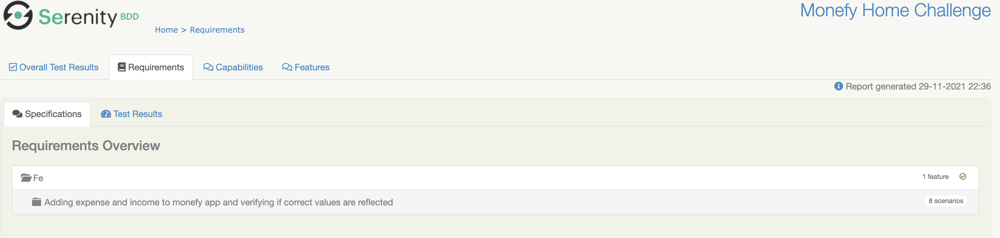

# Monefy Home Challenge

To test this project, execute this command:

    mvn verify test

### Tech Stack
The following tech stack has been used in creation of this project:
1. Java
2. Appium
3. Serenity with cucumber
4. Android app
5. POM

### Prerequisite
To run this project following softwares need to be installed first:
1. Android Studio(create an emulator with name as "AndroidEmulator").
2. Maven
3. IDE of your choice(preferably Intellij)
4. Java
5. Appium
6. Node

### Execution

1. Maven command must run and the test scenarios should start executing.
2. Test suite may contain ***Failed*** test cases.
3. Maven command final result must be a **BUILD SUCCESS** message.
4. You must see a summary of the Serenity tests with totals and execution time data.

   

### Reporting
1. Open [**Serenity BDD HTML report**](../target/site/serenity/index.html) on a web browser and check:
    - API Test reports contain request/response information.
      
      
      
      
      
      

### Approach for this project
1. Firstly I tried to go through all the functionalities of Monefy app to understand the flow.
2. I noted down all the major functionalities that this app has and prioritized the functionalities I thought were important.
3. I created a rough draft of test cases that I wanted to automate and later created feature file for the same.
4. Then at the end I created page object model for the screens and added some helper classes that all the test cases would require.
5. Then I created Step definitions for the feature file.
6. At the end I worked on the reporting part.

### Reason for choosing this tech stack
1. Java - This is the language I am most comfortable with, and it has good community support if anytime anyone gets stuck
2. Appium - This is a wrapper around selenium which makes it easy to understand 
3. Serenity with cucumber - serenity with cucumber is a very effective framework which reduced the code size drastically and test suites are easy to maintain. Also the feature file is readable for a non-tech person.
4. Android app - this is used for emulator
5. POM - POM is a very effective way to maintain webelements.
