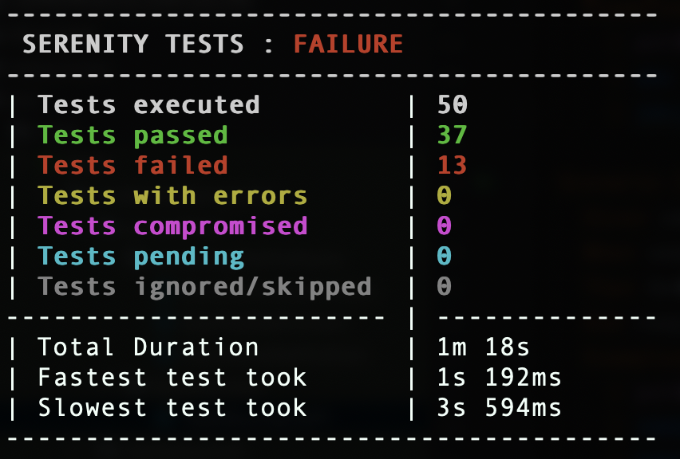

# Pet Store Home Challenge

To test this project, execute this command:

    mvn verify test

### Tech Stack
The following tech stack has been used in creation of this project:
1. Java
2. Rest Assured
3. Serenity with cucumber

### Prerequisite
To run this project following list of software need to be installed first:
1. Maven
3. IDE of your choice(preferably Intellij)
4. Java

### Execution
1. Maven command must run, and the test scenarios should start executing.
2. Test suite may contain ***Failed*** test cases.
3. Maven command final result must be a **BUILD SUCCESS** message.
4. You must see a summary of the Serenity tests with totals and execution time data.
  

   

### Reporting
1. Open [**Serenity BDD HTML report**](../target/site/serenity/index.html) on a web browser and check:
    - API Test reports contain request/response information.
      
      
      
      
      

### Approach for this project
1. Firstly I created a postman suit for the APIs provided in swagger document.
2. I noted down all the request and response specifications of the APIs.
3. I created a rough draft of test cases that I wanted to automate and later created feature file for the same.
4. Then I created Step definitions for the feature file.
5. At the end I worked on the reporting part.

### Reason for choosing this tech stack
1. Java - This is the language I am most comfortable with, and it has good community support if anytime anyone gets stuck
2. Rest Assured - This is the best way to automate rest APIs.
3. Serenity with cucumber - serenity with cucumber is a very effective framework which reduced the code size drastically and test suites are easy to maintain. Also the feature file is readable for a non-tech person.